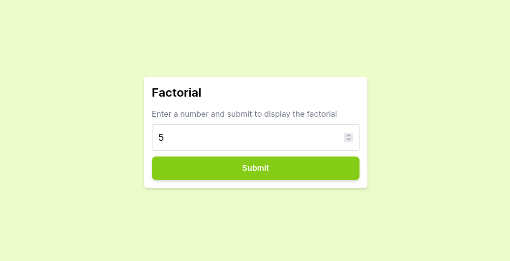
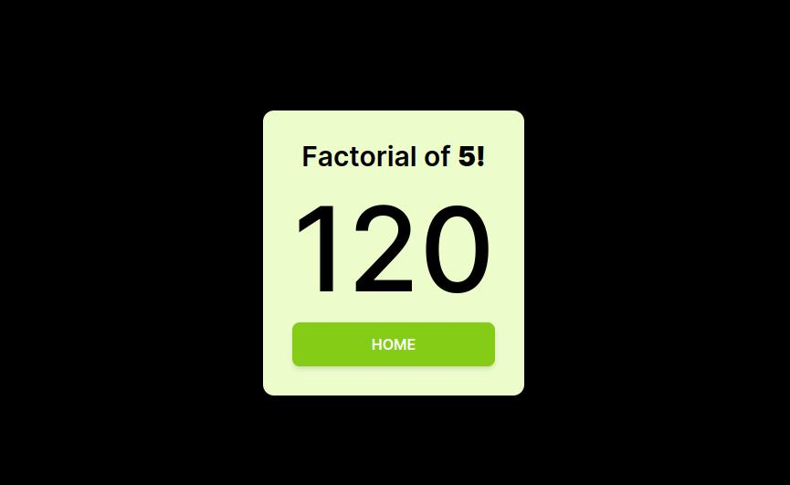

<strong><h1 align="center">Factorial</h1></strong>
<p align="center"><strong>Project developed for a technical challenge/test</strong></p>

<p align="center">
  
</p>

<p align="center">
  
</p>

## 🚀 Challenge
Write a function to calculate the factorial of a number. Next, create a program that allows the user to enter a number and displays the corresponding factorial..

## 🛰️ Technologies
This project was developed with the following technologies:

- Typescript
- React.js
- Next.js
- TailwindCSS

This is a [Next.js](https://nextjs.org/) project bootstrapped with [`create-next-app`](https://github.com/vercel/next.js/tree/canary/packages/create-next-app).
## 💻 Installation / How to use
- Clone this repository:
   ```bash
   git clone https://github.com/jairokoning/factorial.git
   ```
- Install dependencies:
   ```bash
   npm install
   ```
- Start the development server
   ```bash
   npm run dev
   ```
- Open [http://localhost:3000](http://localhost:3000) with your browser to see the result.
---

_Developed with_ 😀 _and_ ❤️ _by [Jairo Koning](https://linkedin/in/jairokoning)_

